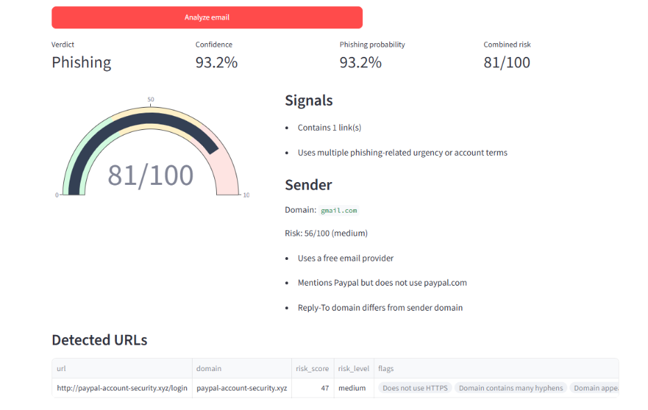

# 🛡️ PhishShield AI – Intelligent Phishing Email Detection System

## 📌 Overview

PhishShield AI is a machine learning-based phishing email detection system designed to identify malicious emails by analysing their content and assigning a threat score. The project helps users distinguish between legitimate and phishing emails through an interactive dashboard and intelligent URL analysis.

## 🚀 Features

- 📧 Email phishing detection using Machine Learning
- 🔍 URL analysis for suspicious links
- ⚠️ Threat score generation
- 📊 Interactive Streamlit dashboard
- 📈 Prediction confidence display
- 📝 Email preprocessing and feature extraction
- 📂 Simple and modular project structure

## 🛠️ Tech Stack

- **Programming Language:** Python
- **Machine Learning:** Scikit-learn
- **Frontend:** Streamlit
- **Libraries:** Pandas, NumPy, NLTK, Scikit-learn
- **Version Control:** Git & GitHub

## 📂 Project Structure

```
PhishShield-AI/
│
├── backend/
├── datasets/
├── frontend/
├── screenshots/
├── requirements.txt
└── README.md
```

## ⚙️ Workflow

```
Email Input
      │
      ▼
Preprocessing
      │
      ▼
Feature Extraction
      │
      ▼
Machine Learning Model
      │
      ▼
URL Analysis
      │
      ▼
Threat Score Calculation
      │
      ▼
Prediction
      │
      ▼
Streamlit Dashboard
```

## 📸 Screenshots

### Home Page


### Dashboard



## ▶️ Installation

```bash
git clone https://github.com/yourusername/PhishShield-AI.git

cd PhishShield-AI/frontend

pip install -r requirements.txt

streamlit run streamlit_app.py
```

## 🎯 Future Enhancements

- FastAPI backend
- Deep learning (DistilBERT)
- QR code phishing detection
- OCR for image-based phishing emails
- Browser extension
- Threat intelligence integration
- User authentication
- Analytics dashboard

## 📜 License

This project is developed for educational and portfolio purposes.
